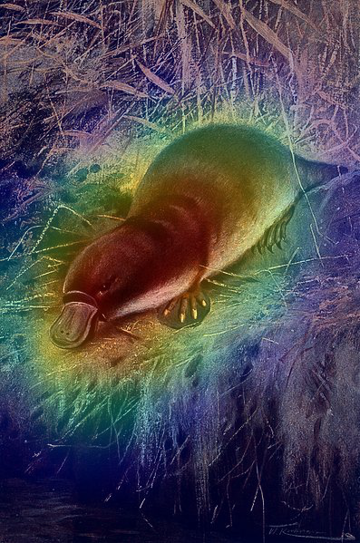
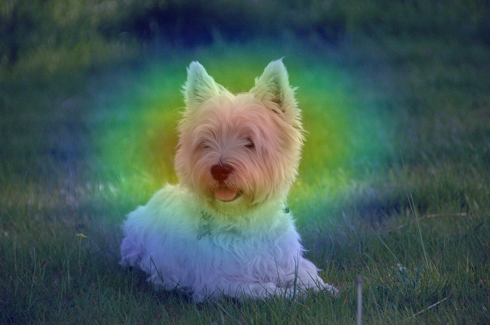

# Keras Grad-CAM demo

  
  
  

-----------------

Notebook demo on how to use Keras to classify images with Xception net, and obtain visual explanations with Grad-CAM. Just use the binder link above to launch it!

Alternatively, if you want to run this demo locally, install a [python Anaconda distribution](https://www.anaconda.com/products/individual) and then create the environment using the provided environment file:

    conda env create -f environment.yml

After this, log into the environment

    conda activate keras-gradcam-demo

and start Jupyter notebook with

    jupyter notebook

Open the notebook named `keras_gradcam_demo` and you are ready to go!
